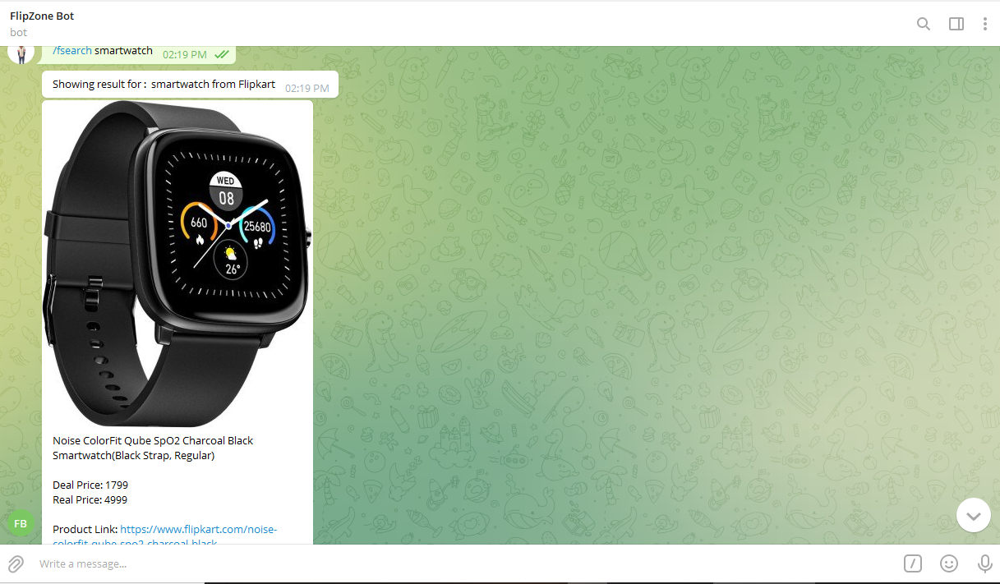

# Flipzone Telegram Bot

You can use it to search for products on amazon and flipkart from telegram.
This bot use amazon and flipkart affiliate api for fetching product details using keywords.

## Features

- Supports Amazon and Flipkart Both.
- Give products details with image and their price.

  
## Deployment

To deploy this project run

- First create your bot from @Botfather in telegram app
- Host this files to your server and insert api-token to your own bot token which you got from bot father on bot.php.
- Change amazon access key, secret key and assosciate tag to your own token in amazon.php. 
- Change flipkart affiliate tag and token to your own token in flipkart.php. 
- Set webhook to your server where the host your file https://api.telegram.org/bot(api-token)/setwebhook?url=(server-url)/bot.php
- Voila! Your bot is running.

## How to use
To use it send /Asearch for amazon and /Fsearch for Flipkart Name of Product. 

For example: /Asearch smartwatch or /Fsearch smartwatch

